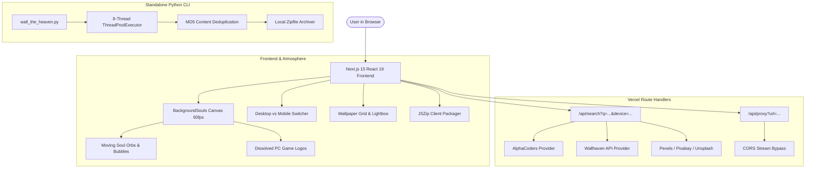

<div align="center">

# 🌌 Wall-the-Heaven
### Ethereal Multi-Source High-Resolution Wallpaper Discovery & Downloader

An atmospheric, fullstack wallpaper engine engineered for **Desktop** and **Mobile** devices.  
Automatically aggregates high-resolution wallpapers across top sources with live form factor filtering, interactive ethereal canvas physics, and 1-click in-browser batch ZIP generation.

[](https://vercel.com/new/clone?repository-url=https%3A%2F%2Fgithub.com%2FMd-Saim%2FWall-The-Heaven)
[](https://github.com/Md-Saim/Wall-The-Heaven)
[](https://opensource.org/licenses/MIT)
[](https://github.com/Md-Saim/Wall-The-Heaven/actions)
[](https://nextjs.org/)
[](https://react.dev/)
[](https://www.typescriptlang.org/)

---

### 🖥️ Desktop Experience


<br/>

### 📱 Responsive Mobile Experience


</div>

---

## 📖 Introduction

Searching for crisp, genuine 1080p, 2K, 4K, and 5K wallpapers often leads to watermarked stock websites, intrusive advertisements, or generic low-resolution thumbnails.

**Wall-the-Heaven** eliminates the clutter. By combining a zero-auth multi-source aggregation architecture with device-specific aspect ratio awareness, users can select whether they need a wallpaper for their **Laptop/Desktop** or **Phone**, enter any character, game, or theme, and receive pristine wallpapers sorted by pixel density with one-click individual or batch ZIP downloads.

---

## ⚡ Automated CI/CD & Vercel Deployment

Every push to `main` triggers a complete continuous integration and delivery pipeline:
1. **GitHub Actions (`ci.yml`)**: Builds the Next.js production bundle, type-checks TypeScript, and verifies routes.
2. **Vercel Automatic Webhook**: Detects commits to `main` and immediately rolls out new production deployments across global edge servers in under 30 seconds.

---

## ✨ Key Features

- **Atmospheric Ethereal Background Engine**:
  - 60fps HTML5 Canvas particle system simulating luminescent floating soul bubbles and orbs.
  - Organic upward drift with sinusoidal waver and real-time mouse repulsion physics.
  - **Dissolved PC Game Watermarks**: Softly dissolving, low-opacity (4%-8%) vector emblems of iconic PC titles (*Dark Souls, Elden Ring, Cyberpunk 2077, The Witcher 3, Skyrim, Half-Life, DOOM Slayer*) drifting and breathing in the cosmic fog.
- **Form Factor & Aspect Ratio Switcher**:
  - **🖥️ Desktop / Laptop**: Automatically targets landscape ratios (`16:9`, `16:10`, `21:9 Ultrawide`) with resolutions up to 5120×2160.
  - **📱 Mobile / Phone**: Targets vertical portrait ratios (`9:16`, `9:20 AMOLED`) for smartphones and lockscreens.
  - **🌐 All Form Factors**: Dynamic hybrid grid with smart device badges.
- **Multi-Source Unified Aggregator**:
  - **AlphaCoders (Wallpaper Abyss)**: High-resolution gaming, anime, movie, and character wallpapers with Schema.org image extraction.
  - **Wallhaven.cc**: Digital art and anime wallpapers with automatic fallback on API downtime.
  - **Pexels / Pixabay / Unsplash**: Optional API providers configurable via environment variables.
- **Client-Side In-Browser ZIP Generator**:
  - Multi-select checkboxes + **Select All** toggle.
  - Streaming parallel download via `JSZip` + `file-saver` directly in your browser with real-time percentage progress.
- **Fullscreen Lightbox Viewer**:
  - Full-resolution inspection with resolution badges, aspect ratio details, source attribution, and direct downloads.
- **Standalone Python CLI Tool Included**:
  - Dedicated CLI version located in `cli/` for terminal power users with 8-thread concurrent downloads.

---

## 🏗️ Technical Architecture



---

## 🛠️ Technology Stack

| Layer | Technology | Details |
|---|---|---|
| **Framework** | [Next.js 15.5](https://nextjs.org/) | App Router, Server Components, Route Handlers |
| **UI Library** | [React 19](https://react.dev/) | Concurrent rendering, Hooks |
| **Language** | [TypeScript 5.7](https://www.typescriptlang.org/) | Strict type safety, interface contracts |
| **Styling** | Vanilla CSS + CSS Modules | Glassmorphism (`backdrop-filter`), HSL tokens, Outfit & JetBrains Mono typography |
| **Canvas Graphics** | HTML5 Canvas 2D API | Particle physics, radial gradients, mouse repulsion, vector SVG blitting |
| **Icons** | [Lucide React](https://lucide.dev/) | Lightweight, modern icon set |
| **Client Archiving** | [JSZip](https://stuk.github.io/jszip/) + [FileSaver](https://github.com/eligrey/FileSaver.js/) | In-memory ZIP packaging and browser file export |
| **Serverless Deployment** | [Vercel](https://vercel.com/) | Edge network, automatic GitHub webhook deployments |
| **Python CLI** | Python 3.9+ | `requests`, `concurrent.futures`, `zipfile`, `colorama` |

---

## 🚀 Deployment Guide

### One-Click Vercel Deployment

1. Push your changes to your GitHub repository:
   ```bash
   git add .
   git commit -m "feat: complete Wall-the-Heaven setup"
   git push -u origin main
   ```
2. Navigate to [https://vercel.com/new](https://vercel.com/new).
3. Import **`Md-Saim/Wall-The-Heaven`**.
4. Click **Deploy**. Vercel will build and launch your application globally in seconds!

---

## 💻 Local Development Setup

### 1. Prerequisites
- **Node.js**: v18.0 or higher
- **npm** (or **pnpm** / **yarn**)
- **Python 3.9+** (if using the CLI tool)

### 2. Installation
```bash
# Clone repository
git clone https://github.com/Md-Saim/Wall-The-Heaven.git
cd Wall-The-Heaven

# Install dependencies
npm install

# Run development server
npm run dev
```

Open [http://localhost:3000](http://localhost:3000) to view the application.

### 3. Production Build
```bash
npm run build
npm run start
```

---

## 📡 API Reference

### `GET /api/search`
Searches wallpaper providers and returns structured, deduplicated wallpaper objects.

#### Query Parameters:
- `q` *(string, default: "Cyberpunk 2077")*: Search keyword.
- `device` *(string, default: "desktop")*: `'desktop'` (16:9), `'mobile'` (9:16), or `'all'`.
- `minRes` *(string, default: "all")*: `'all'`, `'1080p'`, `'1440p'`, or `'4k'`.
- `limit` *(number, default: 30)*: Maximum number of results to return.

#### Example Response:
```json
{
  "success": true,
  "query": "Zhongli",
  "device": "desktop",
  "minRes": "all",
  "total": 28,
  "results": [
    {
      "id": "alpha-1180475",
      "source": "AlphaCoders",
      "url": "https://images2.alphacoders.com/118/1180475.jpg",
      "previewUrl": "https://images2.alphacoders.com/118/thumb-350-1180475.webp",
      "width": 4872,
      "height": 2250,
      "aspectRatio": 2.17,
      "device": "desktop",
      "resolutionStr": "4872x2250",
      "title": "Zhongli Genshin Impact 4K Wallpaper",
      "fileType": "jpg"
    }
  ]
}
```

---

### `GET /api/proxy`
Streams cross-origin image binaries with permissive CORS headers to allow browser-side JSZip blob compilation.

#### Query Parameters:
- `url` *(string, required)*: URL-encoded target image URL.

---

## 🐍 Standalone Python CLI Tool

The Python CLI downloader is housed inside `cli/`:

```bash
cd cli
pip install -r requirements.txt

# Interactive wizard mode
python wall_the_heaven.py

# CLI fast mode (download 30 wallpapers for Zhongli)
python wall_the_heaven.py "Genshin Impact Zhongli" --count 30

# Download 50 4K wallpapers and save ZIP only
python wall_the_heaven.py "Cyberpunk 2077" --count 50 --min-res 3840x2160 --zip-only
```

---

## 📁 Repository Structure

```
Wall-The-Heaven/
├── .github/
│   └── workflows/
│       └── ci.yml             # GitHub Actions CI automated build & verify workflow
├── app/
│   ├── layout.tsx             # Root layout with metadata and Outfit typography
│   ├── page.tsx               # Main interactive explorer page
│   ├── globals.css            # Design tokens, dark theme, sleek scrollbars
│   ├── api/
│   │   ├── search/route.ts    # Multi-source parallel search API
│   │   └── proxy/route.ts     # Cross-origin streaming proxy
│   └── components/
│       ├── BackgroundSouls.tsx    # Canvas animation (souls + dissolved PC game logos)
│       ├── Header.tsx             # Navigation, source indicators, GitHub link
│       ├── SearchBar.tsx          # Search bar with Desktop vs Mobile switcher
│       ├── WallpaperCard.tsx      # Responsive card with device & resolution badges
│       ├── WallpaperGrid.tsx      # Masonry grid with skeleton loaders
│       ├── LightboxModal.tsx      # Fullscreen preview modal
│       └── BatchDownloadBar.tsx   # Floating bottom dock with live ZIP progress
├── public/
│   ├── game-logos/            # Crisp SVG vector emblems (Dark Souls, Elden Ring, etc.)
│   └── screenshots/           # High-resolution desktop and mobile preview screenshots
├── cli/                       # Standalone Python CLI tool
│   ├── wall_the_heaven.py
│   ├── requirements.txt
│   ├── config.json.example
│   ├── src/
│   └── tests/
├── vercel.json                # Vercel deployment configuration
├── package.json
├── tsconfig.json
├── next.config.js
├── LICENSE                    # MIT License
└── README.md                  # Documentation
```

---

## 📜 License

This project is open source and available under the [MIT License](LICENSE).

Copyright (c) 2026 [Md-Saim](https://github.com/Md-Saim).
