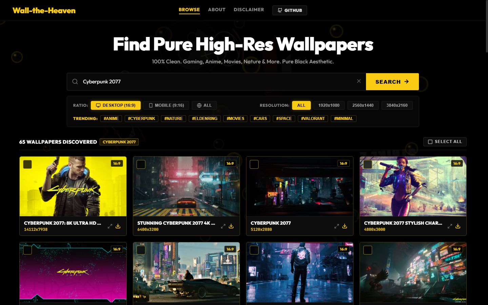
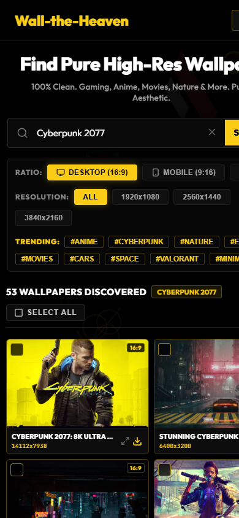

<div align="center">

# Wall-the-Heaven
### High-Resolution Wallpaper Discovery &amp; Pack Downloader

**100% Clean. Gaming, Anime, Movies, Nature &amp; More. Pure Black Aesthetic.**  
Search and download genuine 4K, 2K, and 1080p wallpapers tailored specifically for your **Desktop (16:9)** or **Mobile (9:16)** device, with one-click full collection ZIP downloads.

[](https://vercel.com/new/clone?repository-url=https%3A%2F%2Fgithub.com%2FMd-Saim%2FWall-The-Heaven)
[](https://github.com/Md-Saim/Wall-The-Heaven)
[](LICENSE)
[](https://vercel.com/)

---

### Desktop / Laptop Interface (16:9)


<br/>

### Responsive Mobile Interface (9:16)
<p align="center">
  
</p>

</div>

---

## Features

- **Pure Black Aesthetic**:
  - Deep pitch-black theme with high-contrast electric gold/yellow accents.
  - Interactive background with floating glassy bubbles and dissolved, low-opacity ambient emblems (*Cyberpunk, Elden Ring, Valorant, CS2, Steam, Witcher*).
- **Desktop & Mobile Form Factor Engine**:
  - **Desktop / Laptop (16:9, 16:10, 21:9 Ultrawide)**: Delivers landscape wallpapers up to 4K and 5K.
  - **Mobile / Smartphone (9:16, 9:20 AMOLED)**: Delivers vertical wallpapers fitted for phone lockscreens and home screens.
  - Fully responsive compact 2-column grid adapting smoothly on all mobile screens.
- **Instant Wallpaper Pack ZIP Generation**:
  - Select individual wallpapers or click **Select All**.
  - Packs your chosen wallpapers into a single clean `.zip` file with real-time download progress.
- **Quality Filters**:
  - Filter by **ALL**, **1080p FHD**, **2560x1440 2K**, and **3840x2160 4K**.
  - Trending shortcuts: `#ANIME`, `#CYBERPUNK`, `#NATURE`, `#ELDENRING`, `#MOVIES`, `#CARS`, `#SPACE`, `#VALORANT`, `#MINIMAL`.
- **Dedicated Pages & SEO**:
  - `/browse` — Full wallpaper gallery with instant 0ms device ratio switching.
  - `/about` — Platform background and developer attribution to Md-Saim.
  - `/disclaimer` — Technical architecture, target audience, and fair use copyright notices.
- **Full Navigation & Footer**:
  - Header featuring centered navigation links, GitHub shortcut, and mobile envelope menu drawer.
  - Dedicated footer with form factor shortcuts, operational status, and developer profile links.
- **In-Memory Protection**:
  - Pack status displays real-time warnings to protect ephemeral in-browser packs before page refreshes.
- **Python CLI Tool Included**:
  - Standalone multi-threaded command-line downloader available in the `cli/` folder.

---

## One-Click Vercel Deployment

Deploy your own live version in under a minute:

1. Click the **[Deploy with Vercel](https://vercel.com/new/clone?repository-url=https%3A%2F%2Fgithub.com%2FMd-Saim%2FWall-The-Heaven)** button above (or import `Md-Saim/Wall-The-Heaven` in your [Vercel Dashboard](https://vercel.com/new)).
2. Click **Deploy**. Vercel will build and host your website globally with automatic continuous deployments on every `git push`!

---

## Quick Start (Run Locally)

```bash
# Clone the repository
git clone https://github.com/Md-Saim/Wall-The-Heaven.git
cd Wall-The-Heaven

# Install dependencies
npm install

# Start local server
npm run dev
```

Open [http://localhost:3000](http://localhost:3000) in your browser.

---

## Standalone Python CLI

For terminal power users, the CLI tool is located in `cli/`:

```bash
cd cli
pip install -r requirements.txt

# Interactive wizard
python wall_the_heaven.py

# Fast command (download 30 wallpapers)
python wall_the_heaven.py "Anime Cyberpunk" --count 30

# 4K resolution only
python wall_the_heaven.py "Interstellar Space" --count 50 --min-res 3840x2160 --zip-only
```

---

## License

This project is licensed under the [MIT License](LICENSE) © 2026 [Md-Saim](https://github.com/Md-Saim).
